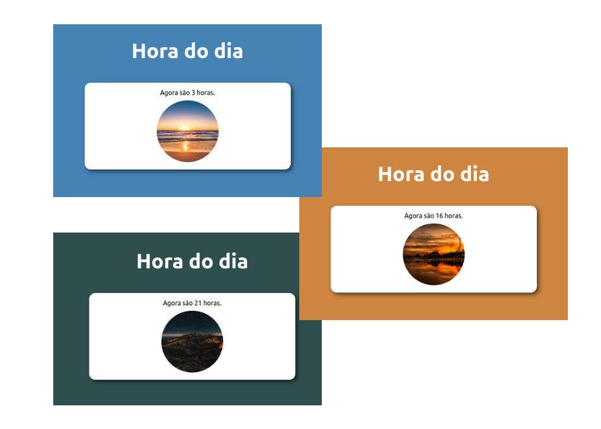

<h1 align="center"> Time of day ⏳⏱️ </h1>

# Sobre o projeto ⏲️
Esse projeto foi feito para fins didáticos com propósito de melhorar as minhas criações de funções no JS e estilizações CSS.

 

# Como acessar o projeto? 🤔

Basta clicar [AQUI](https://analudms.github.io/TimeOfDay/) que você será direcionado!

# Apresentação 👀

  

# Tecnologias 💻
- HTML e CSS.
- Javascript.
- Git e Github.

# Autor 👩🏻

Ana Luiza de Melo Soares.  
https://www.linkedin.com/in/ana-luiza-melo-8b94181b3/